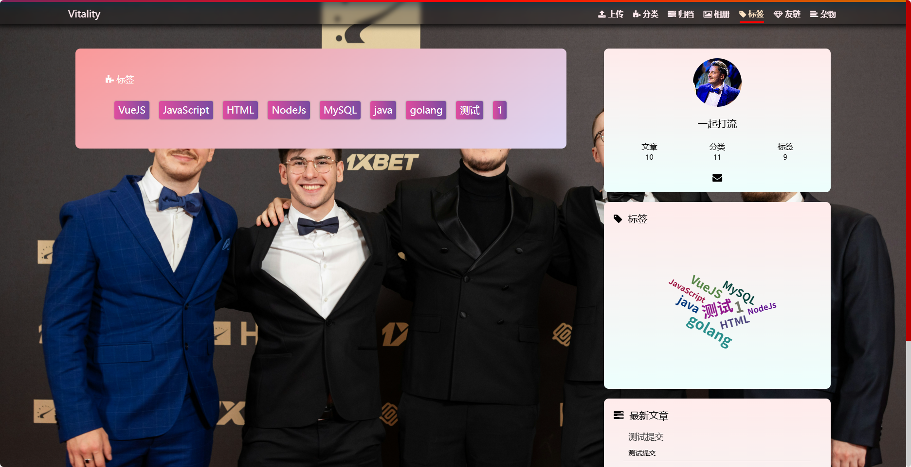
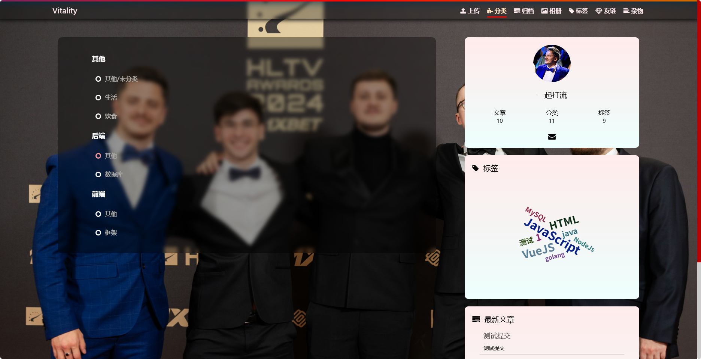
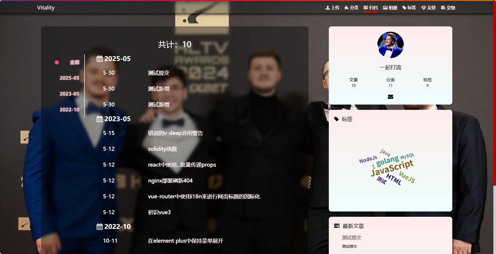
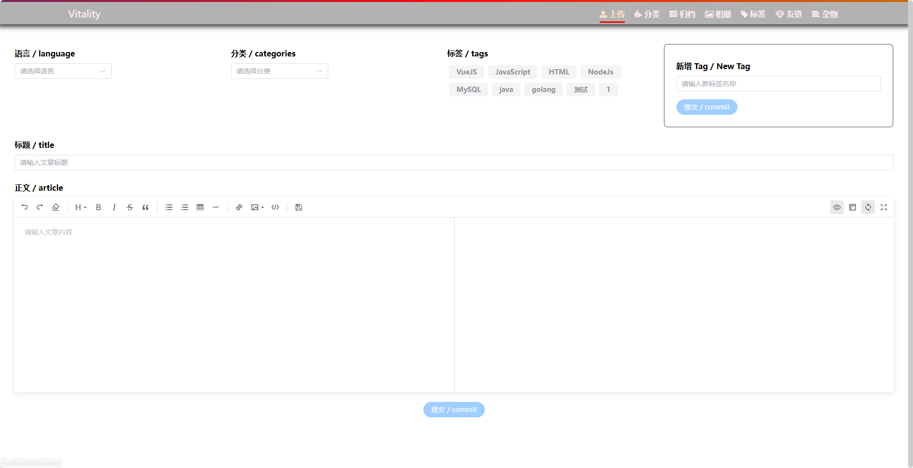
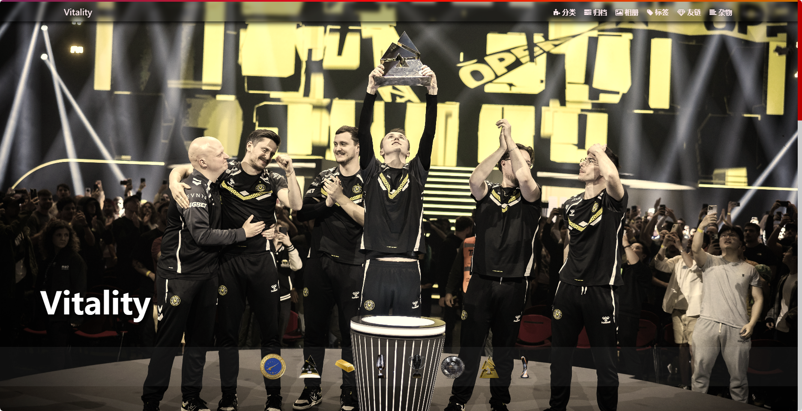
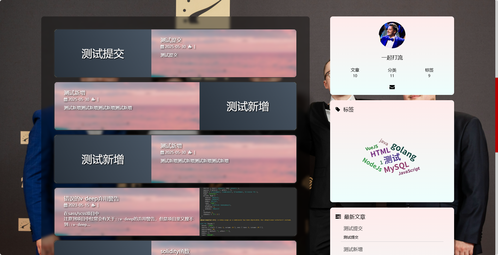
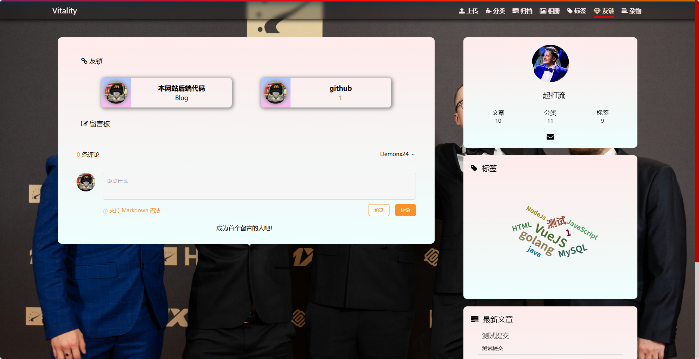

# Vblog-backend
Vblog-backend 
本人初学go，参照前辈开源的博客前后端，对照api接口编写的go后端。
前端链接https://github.com/hibichann/Vblog-frontend
感谢前辈开源

### 5.30 

大部分接口以及重构，只剩下相册，端午节了可能会去写新的项目，这个会陆陆续续完善，之后会添加jwt，es，redis等

前端感觉被我改的面目全非了哈哈哈哈哈，不想再去修改

